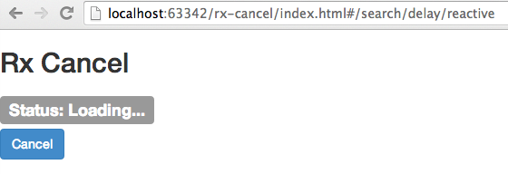
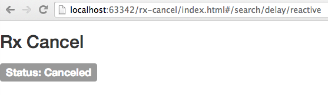
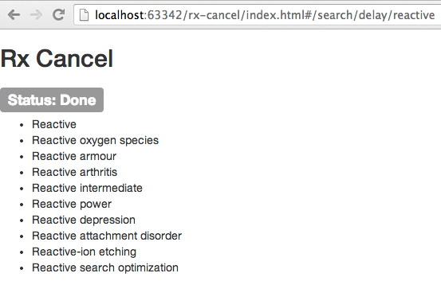
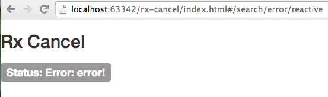

# Rx Cancel

## Observable with simulated delay in an Angular resolver

            $routeProvider.when('/search/delay/:term', {
                templateUrl: 'views/results.html',
                resolve: {
                    results: function ($http, $route) {
                        // returning a promise would delay the controller instantiation until the promise is resolved
                        //return dataProvider($http, $route.current.params.term);

                        var procFn = function(results){
                            return results.data[1]
                        };
                        var dataObservable = promiseToObservable(dataProvider, procFn)($http, $route.current.params.term);

                        return  dataObservable.delay(1500);
                    }
                },
                controller: 'AppCtrl'
            });

## Observable with simulated error in an Angular resolver

            $routeProvider.when('/search/error/:term', {
                templateUrl: 'views/results.html',
                resolve: {
                    results: function ($http, $route) {
                        var errorObservable = Rx.Observable.throw(new Error('error!'));

                        return  errorObservable;
                    }
                },
                controller: 'AppCtrl'
            });

## Observable with retry in an Angular resolver

            $routeProvider.when('/search/retry/:term', {
                templateUrl: 'views/results.html',
                resolve: {
                    results: function ($http, $route) {

                        var procFn = function(results){
                            return results.data[1]
                        };
                        var dataObservable = promiseToObservable(dataProvider, procFn)($http, $route.current.params.term);
                        return dataObservable.catch(dataObservable);
                    }
                },
                controller: 'AppCtrl'
            });

## Controller code with cancelling

                    app.controller('AppCtrl', function ($scope, $http, results) {

                        //$scope.results = results.data[1];

                        $scope.safeApply = function(fn) {
                            var phase = this.$root.$$phase;
                            if(phase == '$apply' || phase == '$digest') {
                                if(fn && (typeof(fn) === 'function')) {
                                    fn();
                                }
                            } else {
                                this.$apply(fn);
                            }
                        };

                        $scope.status = 'Loading...';

                        $scope.showCancel = true;

                        var cancelObservable = createObservableFunction($scope)('cancel', function(){
                            $scope.showCancel = false;
                        }).map(function () {
                                return 'Cancel';
                            });

                        var subscription = cancelObservable.amb(results).subscribe(function (evt) {
                            $scope.safeApply(function(){
                                if (evt === 'Cancel') {
                                    $scope.status = 'Canceled';
                                    $scope.showCancel = false;
                                }
                                else {
                                    $scope.results = evt;
                                }
                            });
                        }, function (err) {
                            $scope.safeApply(function(){
                                $scope.status = '' + err;
                            });
                        }, function () {
                            $scope.safeApply(function(){
                                $scope.status = 'Done';
                            });
                        });